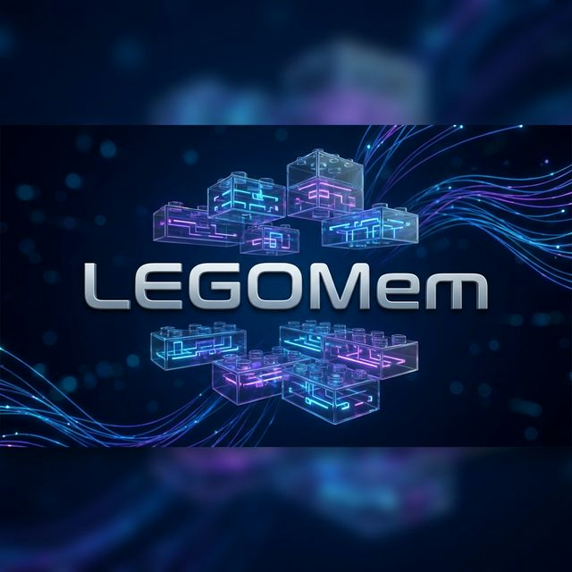

# 🧱 LEGOMem: Modular Procedural Memory for Multi-agent LLM Systems

[](https://opensource.org/licenses/MIT)
[](https://www.python.org/downloads/release/python-3120/)
[](http://makeapullrequest.com)

**LEGOMem** is an implementation of the framework described in the research paper *"LEGOMem: Modular Procedural Memory for Multi-agent LLM Systems for Workflow Automation"* ([arXiv:2510.04851](https://arxiv.org/abs/2510.04851)). It equips multi-agent systems with modular, role-aware procedural memory to enhance planning, coordination, and execution.

---

## 🚀 Why LEGOMem?

Traditional multi-agent systems are often stateless and transactional, solving every task from scratch. **LEGOMem** changes this by distilling successful task trajectories into structured memory units that can be reused like LEGO blocks.

- **Modular**: Decomposes full-task plans into agent-specific subtask traces.
- **Hierarchical**: Supports both high-level orchestration planning and fine-grained tool-use execution.
- **Efficient**: Enables smaller models (e.g., GPT-4o-mini) to match or outperform larger memory-less models.

---

## 📊 Performance Comparison

Based on benchmarks from the original paper, LEGOMem consistently improves the success rate across different agent team configurations on **OfficeBench**.

| Team Configuration | No Memory | LEGOMem (Vanilla) | Improvement |
| :--- | :---: | :---: | :---: |
| **LLM Team** (GPT-4o) | 45.83% | **58.44%** | +12.61% |
| **Hybrid Team** (GPT-4o + SLM) | 35.31% | **48.03%** | +12.72% |
| **SLM Team** (GPT-4o-mini) | 24.78% | **38.16%** | +13.38% |

> [!NOTE]
> The Hybrid team using **LEGOMem-QueryRewrite** achieves **50.22%**, surpassing even the memory-less full LLM team.

---

## 🛠️ Quick Start

### 1. Installation
```bash
# Clone the repository
git clone git@github.com:frederickhoffman/legomem.git
cd legomem

# Install with uv
uv sync
```

### 2. Configuration
Create a `.env` file in the root directory:
```env
OPENAI_API_KEY="your-api-key"
WANDB_API_KEY="your-wandb-api-key"
```

### 3. Run Benchmark
Execute the reproduction suite and view metrics on your WandB dashboard:
```bash
uv run python -m legomem.bench.benchmark --strategies Vanilla Dynamic
```

---

## 🖥️ Modes of Execution

### 📋 Batch Evaluation
Run systematic benchmarks across OfficeBench Levels 1-3. Results are automatically logged to **Weights & Biases**.

### 🎨 Visual Studio (LangGraph UI)
Trace the reasoning process and memory retrieval live in **LangGraph Studio**:
```bash
langgraph dev --local legomem/studio/studio.py
```

---

## 📚 Project Architecture

- **`legomem/core/`**: LangGraph-based Orchestrator and specialized Task Agents.
- **`legomem/memory/`**: Vector store indexing (FAISS), Curation (Distillation), and Retrieval strategies.
- **`legomem/monitoring/`**: WandB integration for experiment tracking.
- **`legomem/bench/`**: Dataset loaders and automated evaluation drivers.

---

## 📄 References

```bibtex
@article{zhong2025legomem,
  title={LEGOMem: Modular Procedural Memory for Multi-agent LLM Systems for Workflow Automation},
  author={Zhong, Wanjun and others},
  journal={arXiv preprint arXiv:2510.04851},
  year={2025}
}
```
